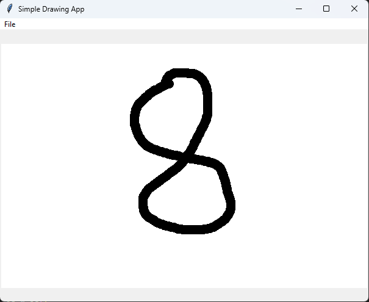
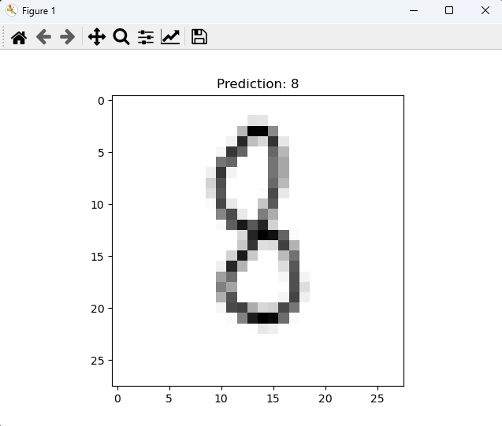

# MNIST Digit Recognizer

## Introduction

This project is an implementation of a digit recognizer using the MNIST dataset. The MNIST dataset contains handwritten digits and is widely used in the machine learning community to benchmark algorithms.

## Features

- **Data Preprocessing**: Convert the MNIST dataset into a usable format for training and validation.
- **Model Training**: Train a neural network to recognize handwritten digits.
- **Evaluation**: Validate the model's performance using a test set.
- **User Interface**: A simple UI for users to draw digits and get predictions from the trained model.

## Setup and Installation

1. **Prerequisites**:
   - Python 3.x
   - TensorFlow
   - Tkinter for the UI

2. **Installation**:
   pip install -r requirements.txt

## Usage

1. Start the application.
2. Draw a digit in the provided canvas.
3. Save the image
4. Get a prediction

## Example

### User Drawn Digit

### Prediction

## License

[MIT](https://choosealicense.com/licenses/mit/)
